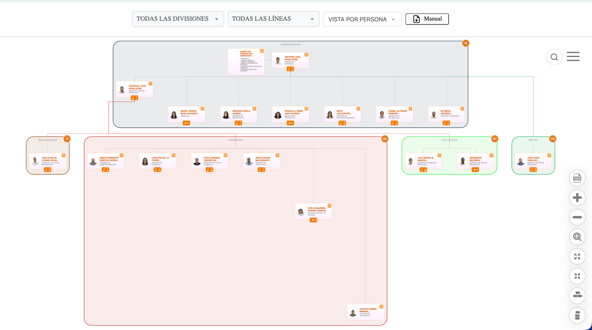
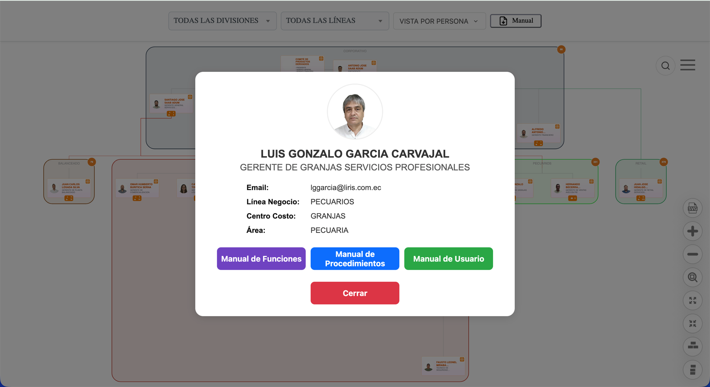
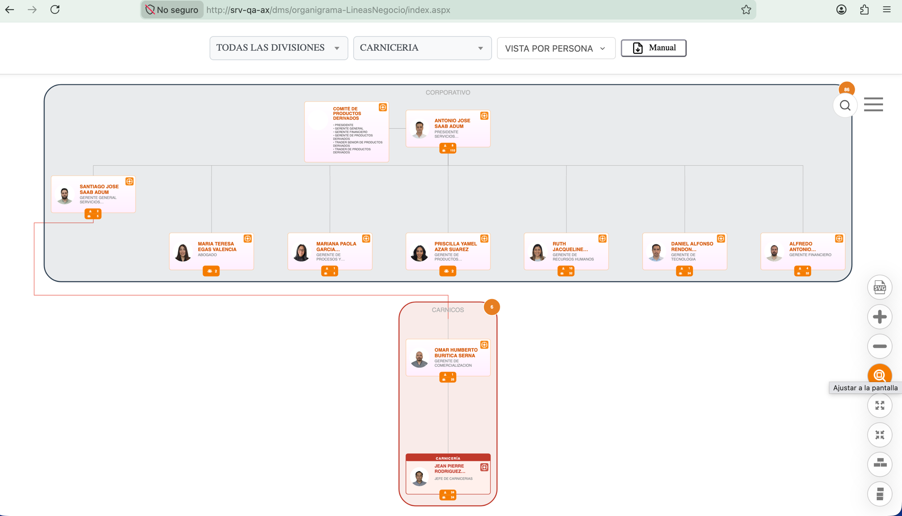

  <h1>🏢 Organigrama Corporativo LIRIS S.A. — Líneas de Negocio</h1>

  <blockquote>
        
Visualización interactiva de la estructura organizacional de <strong>LIRIS S.A.</strong>, basada en <strong>Balkan OrgChart JS (Pro)</strong>. Rama <strong>más reciente y activa</strong> — reemplaza el modelo de cajas anidadas de <code>organigrama-holding</code> por un <strong>layout plano con líneas de reportaje visuales</strong> entre líneas de negocio.

    </blockquote>

   

        
        
        
        
    

  

  <h2>📌 Alcance de esta rama (organigrama-lineasNegocio)</h2>
    
<strong>Rama activa de trabajo</strong> — es donde se implementan los cambios más recientes antes de promoverlos a otras variantes. Evoluciona el modelo de <code>organigrama-holding</code>:

    <ul>
        <li><strong>Sin cajas de división intermedias</strong>: las líneas de negocio (Balanceado, Cárnicos, Pecuarios, Retail) cuelgan directo de <code>GRP_CORPORATIVO</code> — ya no existe el nivel "División Industrial/Comercial/Pecuario" de <code>holding</code>.</li>
        <li><strong>Líneas de reportaje visuales (<code>_slinksManuales</code>)</strong>: en vez de que Balkan dibuje el conector real padre→hijo del grupo, se inyectan líneas SVG manuales en el evento <code>render</code> (con color propio) para que Presidente/Gerente General "reporten visualmente" hacia cada línea de negocio sin que esa línea cuelgue realmente de ellos en el árbol. Se ve en la naranja/roja entre Santiago y Cárnicos/Pecuarios/Balanceado en las capturas.</li>
        <li><strong>Nodos clon para personal compartido entre líneas</strong>: Andrés Herrera (id <code>9987</code>) y el nodo de Cárnicos (<code>codigoPosicion 00943</code>) se duplican visualmente para aparecer en más de una línea de negocio sin romper el árbol real.</li>
        <li><strong>Nodos fantasma (cabeza invisible)</strong>: Carnicería, Cárnicos y Pecuarios usan una cabeza con <code>tags: ["fantasma"]</code> — invisible en el canvas — de la que cuelgan sus hijos con normalidad (ver 3ra captura: al filtrar por "Carnicería" aparece el sub-grupo <strong>CARNICERÍA</strong> dentro de la caja <strong>CARNICOS</strong>, con Jean Pierre Rodríguez como jefe).</li>
        <li><strong>Comité de Productos Derivados</strong> como "partner" del Presidente, dentro de la misma caja Corporativo (no como caja aparte).</li>
        <li><strong>Contadores</strong> por caja igual que en <code>holding</code> (directos / total subárbol).</li>
        <li>También apunta al endpoint de <strong>QA</strong>.</li>
    </ul>
    
Resto de funciones sin cambios: maximizar/minimizar, colapsar/expandir, centrar, orientación vertical/horizontal, exportar SVG, filtros de Divisiones/Líneas, vista Persona/Cargo, búsqueda con resaltado, ficha de detalle.

    
⚠️ Archivos extra en el repo (no tocar, no son el entry point activo): <code>index_proposito.html</code>, <code>index_sistemas_jerarquias2.html</code>, <code>index_sistemas_jerarquias-old.html</code>, <code>index_sistemas_jerarquias_backup.html</code>.

  

  <h2>📸 Galería Visual</h2>

  
<strong>Layout plano con líneas de reportaje</strong> — Balanceado, Cárnicos, Pecuarios y Retail cuelgan directo de Corporativo; la línea roja conecta a Santiago (Gerente General) con Cárnicos como reportaje visual, sin ser su padre real en el árbol:

  

  <table border="0" style="width: 100%; margin-top: 16px;">
        <tr>
            <td style="width: 50%; vertical-align: top;">
                <h3>👤 Ficha de detalle</h3>
                
Empleado de la línea Pecuarios, con Línea Negocio/Centro Costo/Área.

                
            </td>
            <td style="width: 50%; vertical-align: top;">
                <h3>👻 Nodo fantasma — Carnicería</h3>
                
Filtrando por "Carnicería": aparece dentro de la caja Cárnicos, con Jean Pierre Rodríguez como Jefe de Carnicerías — la cabeza fantasma no se muestra, solo su subgrupo.

                
            </td>
        </tr>
    </table>

  

  <h2>⚙️ Stack</h2>
    <ul>
        <li><strong>Frontend:</strong> HTML5 + CSS3 + JavaScript vanilla — sin build ni package manager.</li>
        <li><strong>Librería de chart:</strong> Balkan OrgChart JS Pro (<code>BalkanPro/orgchart.js</code>) — no modificar.</li>
        <li><strong>Configuración de líneas de negocio:</strong> <code>CABEZAS_ACTIVAS</code> (flat layout, reemplaza la iteración de <code>ESTRUCTURA_MACRO</code> de <code>holding</code>).</li>
        <li><strong>Datos:</strong> API REST de Delportal (WordPress), ambiente <strong>QA</strong>.</li>
    </ul>

  <h2>📋 Requisitos</h2>
    <ul>
        <li>Acceso a la <strong>red corporativa interna</strong> (o VPN).</li>
        <li>Cualquier servidor estático para pruebas locales (Live Server, <code>python3 -m http.server</code>).</li>
    </ul>

  <h2>🚀 Instalación y Desarrollo Local</h2>
  <ol>
        <li>
            <strong>Clonar el repositorio</strong> y hacer checkout de esta rama:
            <pre><code>git clone git@github-empresa:LirisDev/Organigrama.git
git checkout organigrama-lineasNegocio</code></pre>
        </li>
        <li>
            <strong>Servir el proyecto:</strong> Live Server (VS Code) o <code>python3 -m http.server</code>. Usar <code>index_sistemas_jerarquias.html</code>.
        </li>
        <li>
            <strong>Simular el login</strong> — en <code>procesarLoginDeUsuario()</code>, descomentar temporalmente:
            <pre><code>receivedUserId = "interno\\dromero"; //Asistente de desarrollo</code></pre>
            
Revertir antes de commitear.

        </li>
    </ol>

  <h2>🏗️ Arquitectura (resumen)</h2>
    <ul>
        <li><code>CABEZAS_ACTIVAS</code>: mapa de líneas de negocio activas para el layout plano (sustituye a <code>ESTRUCTURA_MACRO</code>).</li>
        <li><code>_slinksManuales</code>: array de <code>{from, to}</code> con las líneas de reportaje visual, inyectadas como SVG en el evento <code>render</code> — <strong>nunca</strong> usar <code>chart.config.slinks</code> nativo de Balkan (crashea, corre antes de que existan todas las posiciones).</li>
        <li>Clones hardcodeados: Andrés Herrera (<code>9987</code>) y Cárnicos (<code>00943</code>) — no generalizar sin entender la lógica anti-duplicación.</li>
        <li>Fantasmas: <code>tags: ["fantasma"]</code> + <code>nodeExtent: {width:0, height:0}</code>, expandidos automáticamente post-render por <code>expandirFantasmas()</code>.</li>
    </ul>
    
Detalle completo en <code>CLAUDE.md</code> del repo (sección Architecture) — está escrito específicamente sobre el estado de esta rama.

  <h2>📐 Estándares del equipo</h2>
    
Esta rama sigue los <strong>Estándares de Desarrollo (GitHub y SQL) de LIRIS S.A.</strong> — convención de ramas/commits (<code>tipo(scope): descripción</code>), checklist pre-PR, nunca commit directo a <code>main</code>/<code>develop</code>. Ver documentación interna del equipo antes de abrir un PR.

  <h2>👨‍💻 Autor / Mantenedor</h2>
    

      <strong><a href="https://www.linkedin.com/in/daroyane/" target="_blank" style="text-decoration: none; color: #0077b5; font-size: 1.1em;">David Romero Yánez</a></strong> 
      <em>Ingeniero de Desarrollo</em> 
        Departamento de Sistemas - LIRIS S.A.
    

  

    
<em>Documentación actualizada a Julio 2026.</em>

