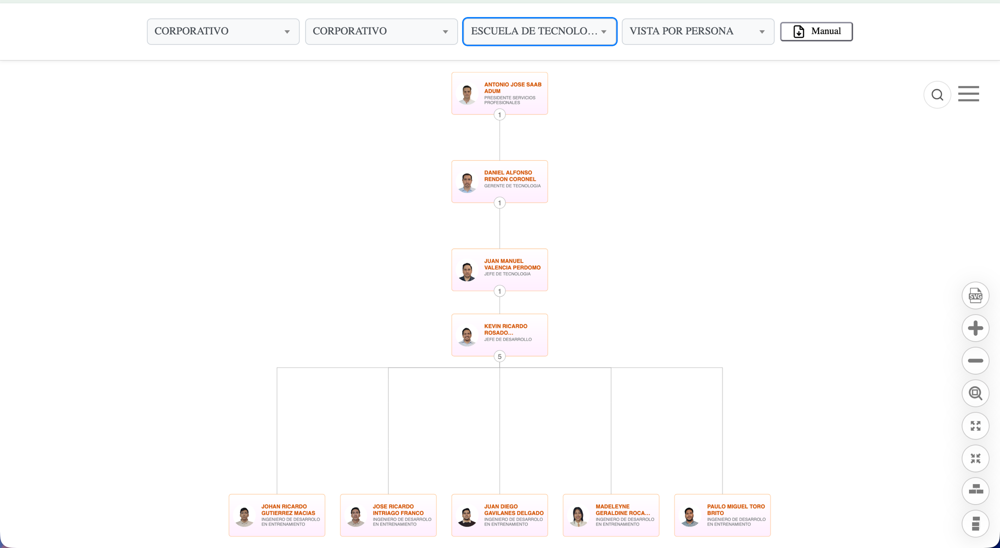
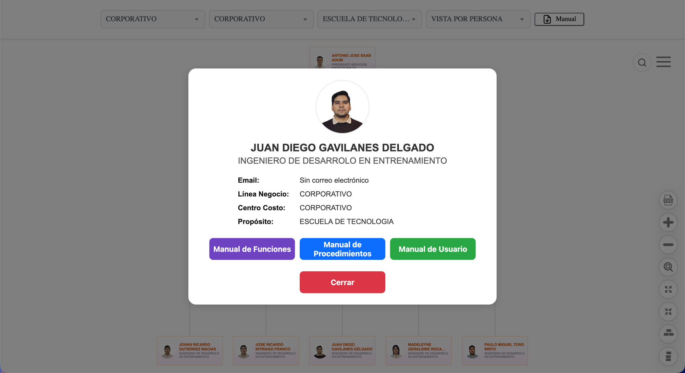

  <h1>🏢 Organigrama Corporativo LIRIS S.A. — Propósito</h1>

  <blockquote>
        
Visualización interactiva de la estructura organizacional de <strong>LIRIS S.A.</strong>, basada en <strong>Balkan OrgChart JS (Pro)</strong>. Variante de <code>main</code> que apunta al endpoint de <strong>QA</strong> y reemplaza el filtro/campo "Departamento" por <strong>"Propósito"</strong>.

    </blockquote>

   

        
        
        
        
    

  

  <h2>📌 Alcance de esta rama (organigrama-proposito)</h2>
    
Igual que <code>organigrama-qa</code>: mismo HTML base que <code>main</code>, apuntando al endpoint de <strong>QA</strong> (<code>mobileqa.liris.com.ec</code>, marcado en el código con <code>//TODO: APUNTA A QA</code>). La diferencia real frente a <code>qa</code> es conceptual, no de infraestructura:

    <ul>
        <li>El filtro y el campo que en <code>main</code>/<code>qa</code> se llaman <strong>"Departamento"</strong> aquí se muestran como <strong>"Propósito"</strong> (mismo dato de la API, renombrado en la UI — ej. "ESCUELA DE TECNOLOGIA" en vez de un nombre de departamento tradicional).</li>
        <li><strong>No tiene el filtro de nivel jerárquico</strong> (sí presente en <code>main</code>) — quedan 3 filtros + vista: Línea de Negocio, Centro de Costo, Propósito, Vista.</li>
    </ul>
    
Resto de funciones igual que producción: maximizar/minimizar, colapsar/expandir, centrar, orientación vertical/horizontal, exportar SVG, vista Persona/Cargo, búsqueda global, ficha de detalle con los 3 manuales.

    
⚠️ Incluye <code>index_proposito.html</code> en la raíz del repo — es un archivo suelto que se agregó junto con estos cambios (ene-2026) y no se ha vuelto a tocar desde entonces, mientras <code>index_sistemas_jerarquias.html</code> sí siguió recibiendo los cambios reales de esta rama. Mismo patrón que otros archivos legacy del proyecto (<code>index_sistemas_jerarquias2.html</code>, <code>-old.html</code>): <strong>ignorar, no es el entry point activo.</strong>

  

  <h2>📸 Galería Visual (datos de QA)</h2>

  <table border="0" style="width: 100%;">
        <tr>
            <td style="width: 50%; vertical-align: top;">
                <h3>🔍 Filtro "Propósito"</h3>
                
Tercer filtro de la barra renombrado a Propósito — aquí filtrando por "Escuela de Tecnología".

                
            </td>
            <td style="width: 50%; vertical-align: top;">
                <h3>👤 Ficha de detalle</h3>
                
Modal de empleado — la fila "Departamento" pasa a llamarse "Propósito".

                
            </td>
        </tr>
    </table>

  

  <h2>⚙️ Stack</h2>
    <ul>
        <li><strong>Frontend:</strong> HTML5 + CSS3 + JavaScript vanilla — sin build ni package manager (idéntico a <code>main</code>).</li>
        <li><strong>Librería de chart:</strong> Balkan OrgChart JS Pro (<code>BalkanPro/orgchart.js</code>) — no modificar.</li>
        <li><strong>Datos:</strong> API REST de Delportal (WordPress), ambiente <strong>QA</strong>: <code>get_organigrama_persona</code> / <code>get_organigrama_cargo</code> en <code>mobileqa.liris.com.ec</code>.</li>
    </ul>

  <h2>📋 Requisitos</h2>
    <ul>
        <li>Acceso a la <strong>red corporativa interna</strong> (o VPN) — el endpoint QA vive dentro de la intranet.</li>
        <li>Cualquier servidor estático para pruebas locales (Live Server, <code>python3 -m http.server</code>).</li>
    </ul>

  <h2>🚀 Instalación y Desarrollo Local</h2>
  <ol>
        <li>
            <strong>Clonar el repositorio</strong> y hacer checkout de esta rama:
            <pre><code>git clone git@github-empresa:LirisDev/Organigrama.git
git checkout organigrama-proposito</code></pre>
        </li>
        <li>
            <strong>Servir el proyecto:</strong> Live Server (VS Code) o <code>python3 -m http.server</code>. Usar <code>index_sistemas_jerarquias.html</code>, no <code>index_proposito.html</code>.
        </li>
        <li>
            <strong>Simular el login</strong> — en <code>index_sistemas_jerarquias.html</code>, dentro de <code>procesarLoginDeUsuario()</code>, descomentar temporalmente:
            <pre><code>receivedUserId = "interno\\dromero"; //Asistente de desarrollo</code></pre>
            
Revertir antes de commitear — es solo para pruebas locales.

        </li>
    </ol>

  <h2>📐 Estándares del equipo</h2>
    
Esta rama sigue los <strong>Estándares de Desarrollo (GitHub y SQL) de LIRIS S.A.</strong> — convención de ramas/commits (<code>tipo(scope): descripción</code>), checklist pre-PR, nunca commit directo a <code>main</code>/<code>develop</code>. Ver documentación interna del equipo antes de abrir un PR.

  <h2>👨‍💻 Autor / Mantenedor</h2>
    

      <strong><a href="https://www.linkedin.com/in/daroyane/" target="_blank" style="text-decoration: none; color: #0077b5; font-size: 1.1em;">David Romero Yánez</a></strong> 
      <em>Ingeniero de Desarrollo</em> 
        Departamento de Sistemas - LIRIS S.A.
    

  

    
<em>Documentación actualizada a Julio 2026.</em>

