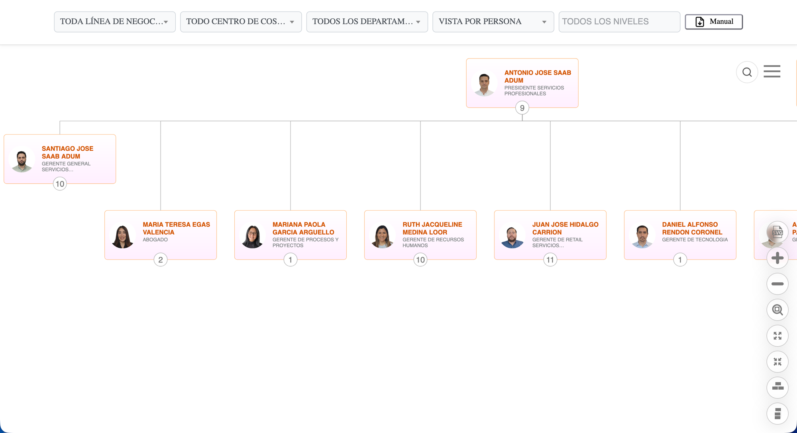
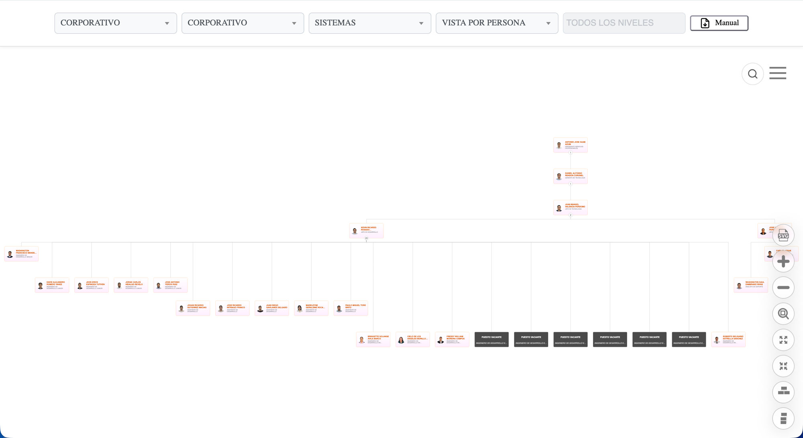
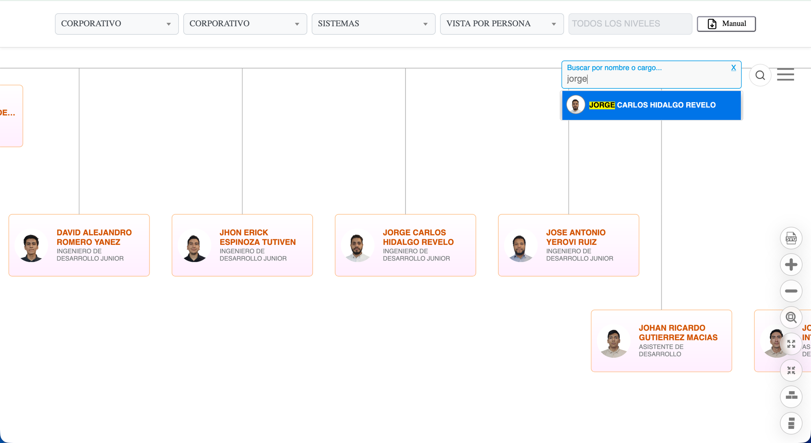
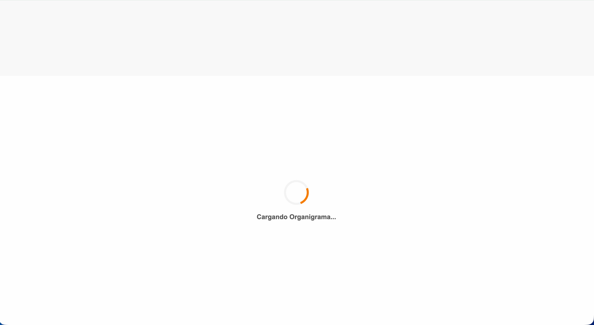

  <h1>🏢 Organigrama Corporativo LIRIS S.A.</h1>

  <blockquote>
        
Visualización interactiva de la estructura organizacional de <strong>LIRIS S.A.</strong>, basada en <strong>Balkan OrgChart JS (Pro)</strong>. Frontend estático (sin build) que consume la API de nómina de Delportal en tiempo real y se integra al ecosistema corporativo vía un wrapper ASP.NET que gestiona la autenticación.

    </blockquote>

   

        
        
        
        
    

  

  <h2>📌 Alcance de esta rama (main / producción)</h2>
    
Esta es la versión <strong>base y en producción</strong> del organigrama: estructura corporativa plana, con <strong>líneas de reportaje comunes</strong> (jefe directo → subordinado, sin agrupaciones especiales ni líneas de reportaje visuales adicionales). No incluye funciones especiales de otras ramas (grupos colapsables por línea de negocio, nodos fantasma, clones, badges de conteo, etc. — ver ramas <code>organigrama-*</code> para esas variantes).

    
Funciones disponibles en esta versión:

    <ul>
        <li><strong>Navegación del árbol:</strong> maximizar / minimizar, colapsar / expandir ramas, centrar en un nodo.</li>
        <li><strong>Orientación:</strong> vertical y horizontal.</li>
        <li><strong>Exportación:</strong> descarga del organigrama en <strong>SVG</strong>.</li>
        <li><strong>Filtros:</strong> línea de negocio, centro de costos, departamento y nivel jerárquico.</li>
        <li><strong>Vistas:</strong> por <strong>Persona</strong> (empleados) o por <strong>Cargo</strong> (posiciones, incluye puestos vacantes).</li>
        <li><strong>Búsqueda global:</strong> localización instantánea por nombre o cargo.</li>
        <li><strong>Ficha de detalle:</strong> modal por colaborador con accesos a Manual de Funciones, Procedimientos y Usuario.</li>
    </ul>

  

  <h2>📸 Galería Visual</h2>

  <table border="0" style="width: 100%;">
        <tr>
            <td style="width: 50%; vertical-align: top;">
                <h3>🔍 Filtros y vista por Persona</h3>
                
Barra de filtros (línea de negocio, centro de costos, departamento, vista, nivel jerárquico) sobre la vista raíz del organigrama.

                
            </td>
            <td style="width: 50%; vertical-align: top;">
                <h3>👤 Ficha de detalle</h3>
                
Modal con foto, correo, línea de negocio/centro de costo/departamento y accesos a los 3 manuales.

                
            </td>
        </tr>
        <tr>
            <td style="width: 50%; vertical-align: top;">
                <h3>🧩 Vista por Cargo</h3>
                
Nodos por posición en vez de persona — incluye puestos vacantes (estilo visual distinto, en gris).

                
            </td>
            <td style="width: 50%; vertical-align: top;">
                <h3>🔎 Búsqueda global</h3>
                
Localización instantánea de un colaborador por nombre o cargo, con resaltado del término buscado.

                
            </td>
        </tr>
    </table>
    
<em>Estado de carga inicial mientras se resuelve el <code>postMessage</code> y se descarga el JSON de la API:</em>

    

  

  <h2>⚙️ Stack</h2>
    <ul>
        <li><strong>Frontend:</strong> HTML5 + CSS3 + JavaScript vanilla — <strong>sin build ni package manager</strong>.</li>
        <li><strong>Librería de chart:</strong> <a href="https://balkan.app/">Balkan OrgChart JS</a>, edición <strong>Pro</strong> (licencia de empresa) en <code>BalkanPro/orgchart.js</code> — no modificar. La base gratuita en <code>Balkan/orgchart.js</code> es legacy, no usada en producción.</li>
        <li><strong>UI auxiliar:</strong> jQuery 3.6, Select2 (filtros), SimpleBar (scroll).</li>
        <li><strong>Datos:</strong> API REST de Delportal (WordPress) — <code>get_organigrama_persona</code> / <code>get_organigrama_cargo</code>.</li>
        <li><strong>Despliegue:</strong> servido dentro de la intranet corporativa bajo un wrapper <strong>ASP.NET</strong> (<code>index.aspx</code>), que autentica al usuario y pasa <code>userId</code> vía <code>postMessage</code>.</li>
    </ul>

  <h2>📋 Requisitos</h2>
    <ul>
        <li>Ningún runtime especial — cualquier servidor estático sirve (VS Code <strong>Live Server</strong> recomendado para evitar problemas de CORS con archivos locales).</li>
        <li>Acceso a la <strong>red corporativa interna</strong> (o VPN) para que la API de Delportal responda con datos reales.</li>
        <li>Navegador con el certificado de la CA interna de confianza (evita warnings TLS al llamar la API por HTTPS).</li>
    </ul>

  <h2>🚀 Instalación y Desarrollo Local</h2>
  <ol>
        <li>
            <strong>Clonar el repositorio:</strong>
            <pre><code>git clone git@github-empresa:LirisDev/Organigrama.git</code></pre>
        </li>
        <li>
            <strong>Servir el proyecto:</strong>
            
Abrir la carpeta con <strong>Live Server</strong> (VS Code) o cualquier servidor estático (ej. <code>python3 -m http.server</code>).

        </li>
        <li>
            <strong>Simular el login (el <code>postMessage</code> del padre ASP.NET no existe en local):</strong>
            
En <code>index_sistemas_jerarquias.html</code>, dentro de <code>procesarLoginDeUsuario()</code>, descomentar:

            <pre><code>receivedUserId = "interno\\dromero"; //Asistente de desarrollo</code></pre>
            
Revertir antes de subir a producción — es solo para pruebas locales.

        </li>
        <li>
            <strong>Apuntar a la API correcta:</strong> si se prueba contra QA en vez de producción, actualizar la URL del endpoint (constante al inicio del script) manteniendo la misma estructura de JSON.
        </li>
    </ol>

  <h2>🔄 Lógica de Datos (API)</h2>
    
El sistema consume un JSON plano con la siguiente estructura crítica:

  <pre><code class="language-json">
 "Persona": [
  {
    "codigoEmpleado": "15",
    "nombre": "ANTONIO JOSE",
    "apellido": "SAAB ADUM",
    "userid": "interno\\ajsaab",       // Clave para autenticación
    "foto": "http://soporte.liris.com.ec/fotorrhh/...",
    "emailCorporativo": "ajsaab@liris.com.ec",

    // --- MOTOR JERÁRQUICO ---
    "codigoPosicion": "00001",         // ID único del nodo
    "codigoPosicionReporta": "00006",  // ID del jefe directo

    "puesto": "PRESIDENTE SERVICIOS PROFESIONALES",

    // --- CAMPOS DE FILTRADO ---
    "nombreDepartamento": "DIRECTORIO",
    "nombreCentroCosto": "CORPORATIVO",
    "nombreLineaNegocio": "CORPORATIVO",

    // --- DOCUMENTACIÓN Y ESTADO ---
    "rutaManual": "Documentos compartidos/...", // Path base para los manuales
    "vacante": "0",          // "0" = Ocupado, "1" = Vacante (estilo visual distinto)
    "nivelJerarquico": "1"   // Define el color del borde
  }
]
    </code></pre>

  <h2>🏗️ Arquitectura</h2>
    <pre><code>
Navegador (Chrome/Edge/Safari)
        │ postMessage(userId)
        ▼
index.aspx (wrapper ASP.NET — autenticación intranet)
        │ embebe vía iframe
        ▼
index_sistemas_jerarquias.html (este proyecto)
        │ fetch()
        ▼
API Delportal (WordPress REST) — mobileqa.liris.com.ec / delportal/wp-json/delportal/v1/
        │
   get_organigrama_persona · get_organigrama_cargo
    </code></pre>
    <ul>
        <li><strong>Sin backend propio:</strong> toda la lógica de permisos, filtros y render vive en el único <code>&lt;script&gt;</code> de <code>index_sistemas_jerarquias.html</code>.</li>
        <li><strong>Permisos:</strong> <code>procesarLoginDeUsuario()</code> resuelve si el usuario ve todo el organigrama (roles gerente/presidente/jefe/analista, etc.) o solo su propio subárbol (<code>codPosicion_R</code>).</li>
        <li><strong>Dos vistas independientes:</strong> Persona (<code>allNodes</code>) y Cargo (<code>allCargoNodes</code>), cada una con su propio endpoint y su propio mapa de cabezas de línea de negocio.</li>
    </ul>

  <h2>📂 Estructura del Repositorio</h2>
    <pre><code>
Organigrama-Jerarquias/
├── 📁 Balkan/                  # Librería base de Balkan OrgChart JS (legacy, no usada en producción)
├── 📁 BalkanPro/               # Librería Balkan OrgChart Pro (licencia empresa) — 👈 [CORE], no modificar
├── 📄 index_sistemas_jerarquias.html  # 👈 [CORE] Toda la lógica: render, filtros, permisos, chart config
├── 🎨 styles.css               # 👈 [CORE] Estilos + responsive breakpoints
├── 🖼️ Logo-Liris.png           # Asset gráfico
├── 📁 img/                     # Capturas de pantalla para este README
├── 📄 README.md                # Este archivo
├── 📄 RRHH-USU-USORGA-V001 Manual de Usuario...pdf
│
├── ⚠️ ARCHIVOS LEGACY (ignorar, no usar como referencia):
├── 📄 index_sistemas_jerarquiasV2.html
└── 📄 visor.html
    </code></pre>

  <h2>📱 Estrategia Responsive</h2>
    <table border="1" cellpadding="10" cellspacing="0" style="width: 100%; border-collapse: collapse;">
        <thead style="background: #f4f4f4;">
            <tr>
                <th>Dispositivo</th>
                <th>Comportamiento UI</th>
            </tr>
        </thead>
        <tbody>
            <tr>
                <td><strong>Escritorio</strong></td>
                <td>Vista completa, controles expandidos y filtros laterales.</td>
            </tr>
            <tr>
                <td><strong>Tablet (&lt;768px)</strong></td>
                <td><strong>Modo grilla:</strong> filtros en 2x2. Búsqueda anclada a la izquierda (60%).</td>
            </tr>
            <tr>
                <td><strong>Móvil (&lt;400px)</strong></td>
                <td><strong>Modo compacto:</strong> fuentes reducidas (10px), inputs delgados (30px) y márgenes seguros.</td>
            </tr>
        </tbody>
    </table>

  <h3>🌍 Compatibilidad</h3>
    <ul>
        <li>✅ Google Chrome (Desktop &amp; Mobile)</li>
        <li>✅ Safari (iOS &amp; macOS)</li>
        <li>✅ Microsoft Edge</li>
    </ul>
    
⚠️ Firefox bloquea <code>cdn.jsdelivr.net</code> (Enhanced Tracking Protection), lo que puede romper la inicialización de Select2 — hay guard defensivo (<code>if ($.fn.select2)</code>) pero no es 100% equivalente a Chrome/Safari.

  <h2>📐 Estándares del equipo</h2>
    
Este proyecto sigue los <strong>Estándares de Desarrollo (GitHub y SQL) de LIRIS S.A.</strong> — convención de ramas/commits, checklist pre-PR, reglas duras (nunca commit directo a <code>main</code>/<code>develop</code>, repos solo en la organización GitHub Enterprise, migraciones SQL con transacciones, probar en QA antes que en servidores de producción, etc). Ver documentación interna del equipo antes de abrir un PR.

  <h2>👨‍💻 Autor / Mantenedor</h2>
    

      <strong><a href="https://www.linkedin.com/in/daroyane/" target="_blank" style="text-decoration: none; color: #0077b5; font-size: 1.1em;">David Romero Yánez</a></strong> 
      <em>Ingeniero de Desarrollo</em> 
        Departamento de Sistemas - LIRIS S.A.
    

  

    
<em>Documentación actualizada a Julio 2026.</em>

