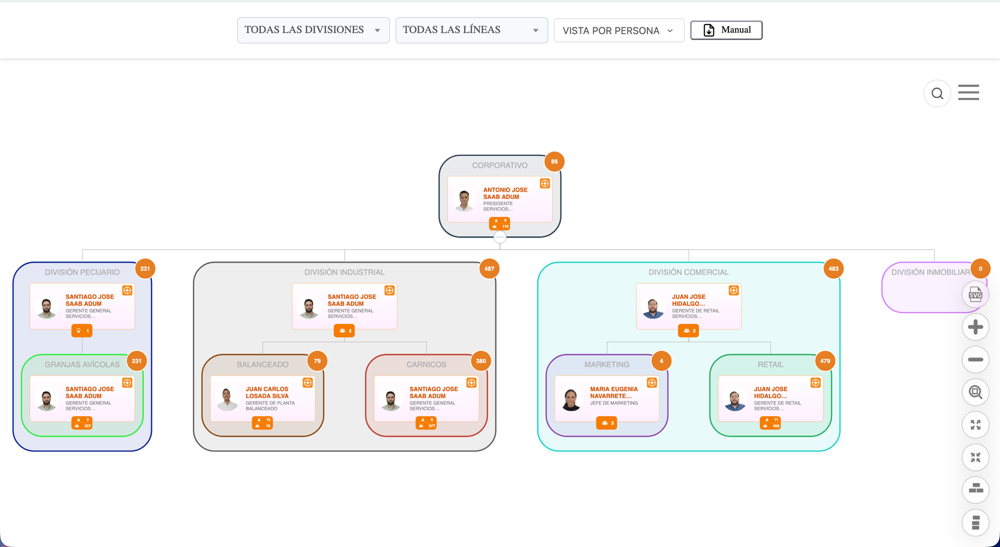
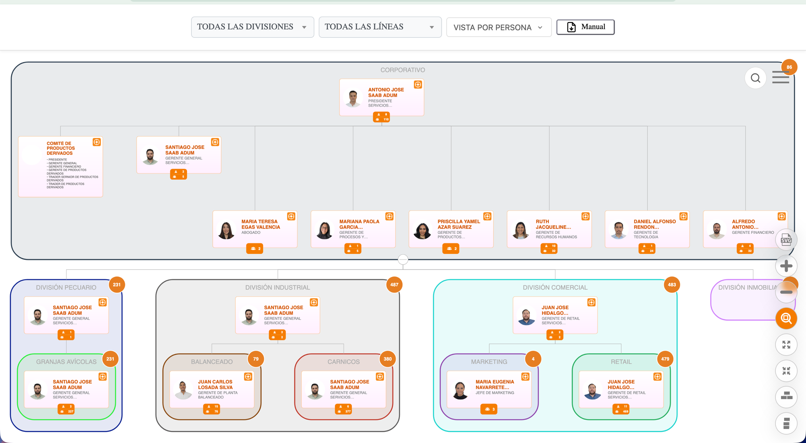
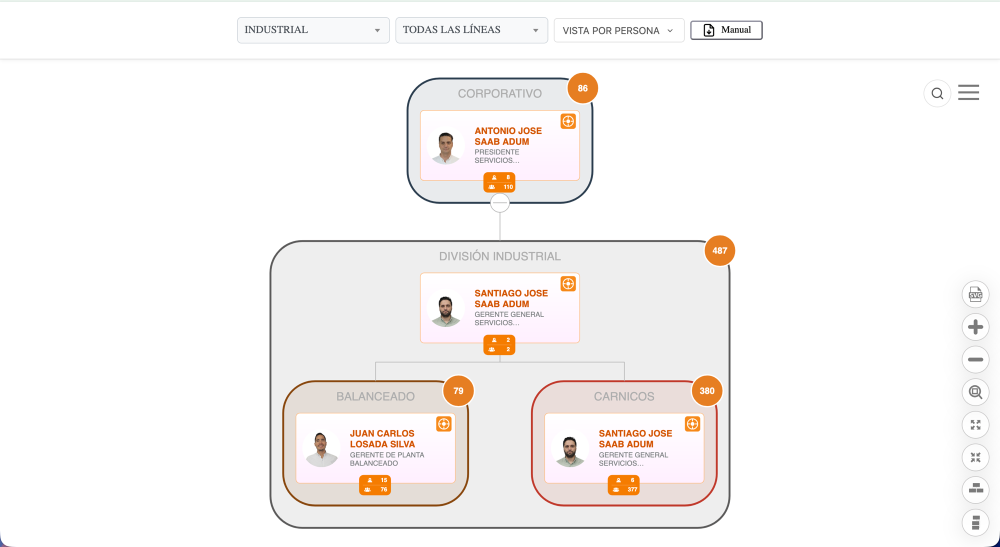
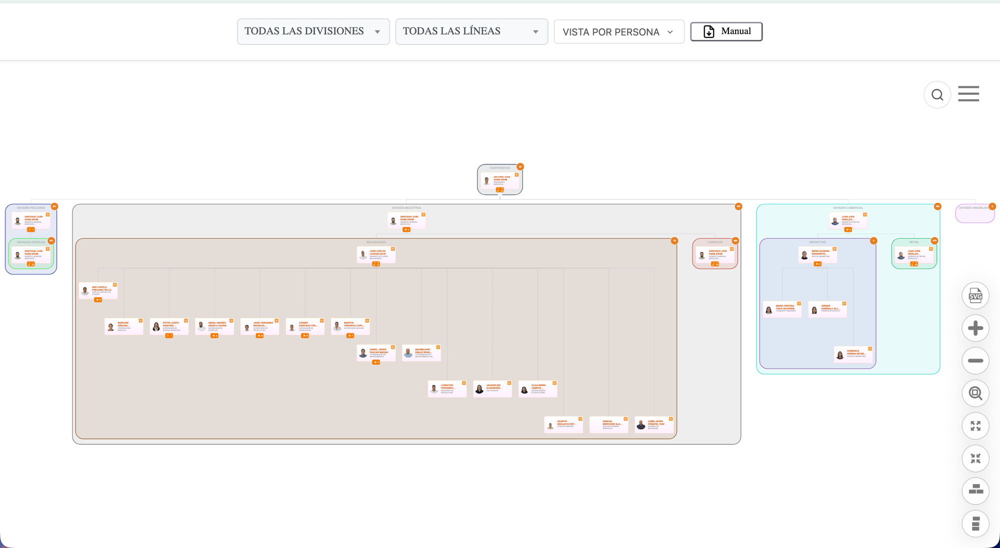

  <h1>🏢 Organigrama Corporativo LIRIS S.A. — Holding</h1>

  <blockquote>
        
Visualización interactiva de la estructura organizacional de <strong>LIRIS S.A.</strong>, basada en <strong>Balkan OrgChart JS (Pro)</strong>. Variante <strong>holding</strong>: agrupa las líneas de negocio bajo divisiones corporativas, con contadores de personal por caja. Arquitectura bastante más compleja que <code>main</code>/<code>qa</code>/<code>proposito</code>.

    </blockquote>

   

        
        
        
        
    

  

  <h2>📌 Alcance de esta rama (organigrama-holding)</h2>
    
A diferencia de <code>main</code>/<code>qa</code>/<code>proposito</code> (estructura plana, reportaje persona→persona), esta rama introduce un <strong>modelo de holding con 3 niveles de agrupación visual</strong>:

    <pre><code>
CORPORATIVO (caja raíz — Presidente + reportes directos + Comité)
  └── DIVISIÓN (caja macro — ej. "DIVISIÓN INDUSTRIAL")
        └── LÍNEA DE NEGOCIO (caja hija — ej. "BALANCEADO", "CARNICOS")
              └── Cabeza de línea + su gente (árbol normal debajo)
    </code></pre>
    <ul>
        <li><strong>Divisiones definidas</strong> (const <code>ESTRUCTURA_MACRO</code>): <code>DIVISIÓN PECUARIO</code> (Granjas Avícolas), <code>DIVISIÓN INDUSTRIAL</code> (Balanceado, Carnicería, Cárnicos), <code>DIVISIÓN COMERCIAL</code> (Retail, Marketing), <code>DIVISIÓN INMOBILIARIA</code> (sin líneas activas todavía, caja vacía).</li>
        <li><strong>Cada división y cada línea de negocio es una caja de color propio</strong> con: título, nodo(s) cabeza dentro, y un <strong>contador naranja</strong> en la esquina superior derecha con el total de personas en ese subárbol.</li>
        <li><strong>Contador doble en el nodo Corporativo/cabezas de división</strong>: ícono de persona = reportes directos, ícono de grupo = total acumulado del subárbol (ej. Corporativo: 8 directos / 110 en total).</li>
        <li><strong>Filtros reducidos a 2 + vista</strong>: <code>TODAS LAS DIVISIONES</code> y <code>TODAS LAS LÍNEAS</code> — ya no hay filtro de Centro de Costo, Departamento/Propósito ni Nivel Jerárquico (esos <code>&lt;select&gt;</code> quedaron comentados en el HTML, código muerto).</li>
        <li><strong>Comité de Productos Derivados</strong> visible como nodo especial colgado directo del Presidente dentro de la caja Corporativo (mismo nodo especial documentado para el proyecto — aquí ya está activo en la UI).</li>
        <li>También apunta al endpoint de <strong>QA</strong> (<code>mobileqa.liris.com.ec</code>, <code>//TODO: APUNTA A QA</code>).</li>
        <li><strong>Búsqueda con resaltado en el canvas:</strong> al elegir un resultado del buscador, el nodo recibe una clase <code>nodo-destacado</code> con animación de pulso naranja (<code>@keyframes pulsoBuscador</code>) — no solo se centra, también se resalta visualmente. No existe en <code>main</code>/<code>qa</code>/<code>proposito</code>.</li>
        <li><code>styles.css</code> también trae ajustes propios de esta rama: scrollbar personalizado (SimpleBar) en el bloque de historial de la ficha de detalle, y truncado con "..." + expansión al hover en los resultados del buscador.</li>
    </ul>
    
Funciones base sin cambios: maximizar/minimizar, colapsar/expandir (click en cualquier caja de división/línea colapsa ese subárbol), centrar, orientación vertical/horizontal, exportar SVG, vista Persona/Cargo, búsqueda global, ficha de detalle.

    
Archivos extra presentes en esta rama (no tocar, no son el entry point activo): <code>index_proposito.html</code>, <code>index_sistemas_jerarquias2.html</code>, <code>index_sistemas_jerarquias-old.html</code> — mismo patrón de legacy que el resto del repo.

  

  <h2>📸 Galería Visual (datos de QA)</h2>

  <table border="0" style="width: 100%;">
        <tr>
            <td style="width: 50%; vertical-align: top;">
                <h3>🗂️ Raíz — Divisiones colapsadas</h3>
                
4 divisiones con su cabeza y contador de personal (Pecuario 231, Industrial 487, Comercial 483, Inmobiliaria 0).

                
            </td>
            <td style="width: 50%; vertical-align: top;">
                <h3>🏢 Corporativo + Comité</h3>
                
Caja Corporativo expandida: Presidente, Comité de Productos Derivados y el resto de gerentes corporativos, con las 4 divisiones colgando debajo.

                
            </td>
        </tr>
    </table>
    
<strong>🔍 División Industrial — zoom</strong> (Corporativo → División Industrial → Balanceado/Cárnicos, con contadores en cada nivel):

    
    
<strong>🌳 Línea de negocio expandida</strong> (Balanceado con todo su personal desplegado):

    

  

  <h2>⚙️ Stack</h2>
    <ul>
        <li><strong>Frontend:</strong> HTML5 + CSS3 + JavaScript vanilla — sin build ni package manager.</li>
        <li><strong>Librería de chart:</strong> Balkan OrgChart JS Pro (<code>BalkanPro/orgchart.js</code>) — no modificar.</li>
        <li><strong>Configuración de divisiones/líneas:</strong> objetos <code>CABEZAS_NEGOCIO_TEMP</code> y <code>ESTRUCTURA_MACRO</code> (vista Persona) / <code>CABEZAS_NEGOCIO_CARGO</code> y <code>ESTRUCTURA_MACRO_CARGO</code> (vista Cargo) — al cambiar cabezas o divisiones, actualizar aquí.</li>
        <li><strong>Datos:</strong> API REST de Delportal (WordPress), ambiente <strong>QA</strong>.</li>
    </ul>

  <h2>📋 Requisitos</h2>
    <ul>
        <li>Acceso a la <strong>red corporativa interna</strong> (o VPN) — el endpoint QA vive dentro de la intranet.</li>
        <li>Cualquier servidor estático para pruebas locales (Live Server, <code>python3 -m http.server</code>).</li>
    </ul>

  <h2>🚀 Instalación y Desarrollo Local</h2>
  <ol>
        <li>
            <strong>Clonar el repositorio</strong> y hacer checkout de esta rama:
            <pre><code>git clone git@github-empresa:LirisDev/Organigrama.git
git checkout organigrama-holding</code></pre>
        </li>
        <li>
            <strong>Servir el proyecto:</strong> Live Server (VS Code) o <code>python3 -m http.server</code>. Usar <code>index_sistemas_jerarquias.html</code>, no los archivos legacy sueltos.
        </li>
        <li>
            <strong>Simular el login</strong> — en <code>index_sistemas_jerarquias.html</code>, dentro de <code>procesarLoginDeUsuario()</code>, descomentar temporalmente:
            <pre><code>receivedUserId = "interno\\dromero"; //Asistente de desarrollo</code></pre>
            
Revertir antes de commitear — es solo para pruebas locales.

        </li>
    </ol>

  <h2>🏗️ Arquitectura (resumen)</h2>
    <ul>
        <li><code>ESTRUCTURA_MACRO</code>: define cada división (<code>id</code>, <code>title</code>, <code>headId</code>, <code>subgrupos</code> = líneas de negocio que contiene).</li>
        <li><code>CABEZAS_NEGOCIO_TEMP</code>: mapea cada línea de negocio a su nodo cabeza (<code>codigoPosicion</code>) y a quién reporta funcionalmente.</li>
        <li>Cada caja (división o línea) recibe un contador calculado recorriendo su subárbol, excluyendo nodos con tag <code>group</code>/<code>fantasma</code>/<code>head-of-group</code>.</li>
        <li>Nodos con tag <code>group</code> o <code>fantasma</code> no abren la ficha de detalle al hacer click — el click en esas cajas colapsa/expande en su lugar.</li>
    </ul>

  <h2>📐 Estándares del equipo</h2>
    
Esta rama sigue los <strong>Estándares de Desarrollo (GitHub y SQL) de LIRIS S.A.</strong> — convención de ramas/commits (<code>tipo(scope): descripción</code>), checklist pre-PR, nunca commit directo a <code>main</code>/<code>develop</code>. Ver documentación interna del equipo antes de abrir un PR.

  <h2>👨‍💻 Autor / Mantenedor</h2>
    

      <strong><a href="https://www.linkedin.com/in/daroyane/" target="_blank" style="text-decoration: none; color: #0077b5; font-size: 1.1em;">David Romero Yánez</a></strong> 
      <em>Ingeniero de Desarrollo</em> 
        Departamento de Sistemas - LIRIS S.A.
    

  

    
<em>Documentación actualizada a Julio 2026.</em>

