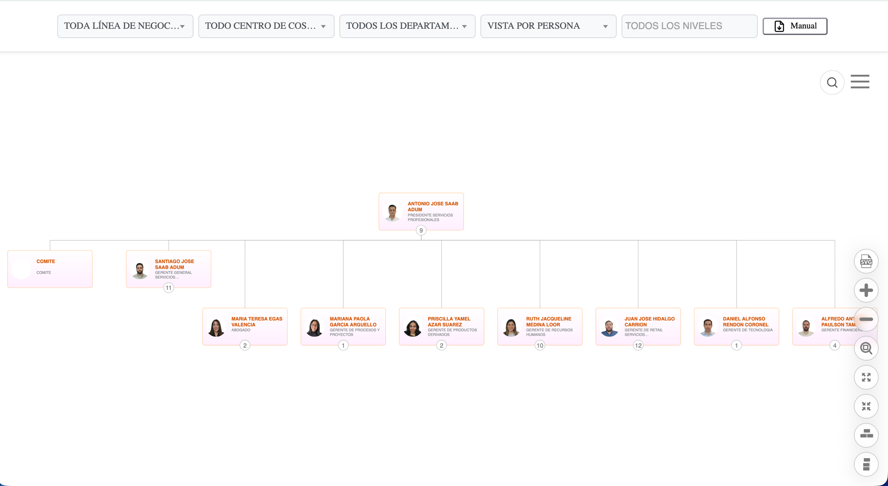
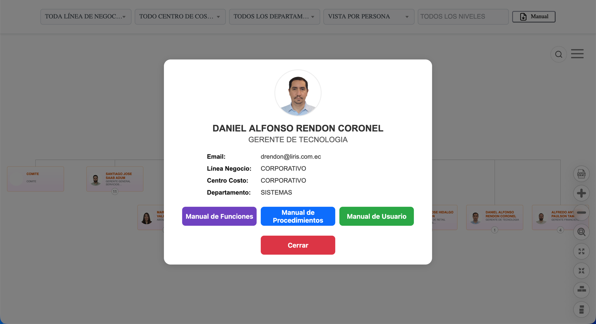
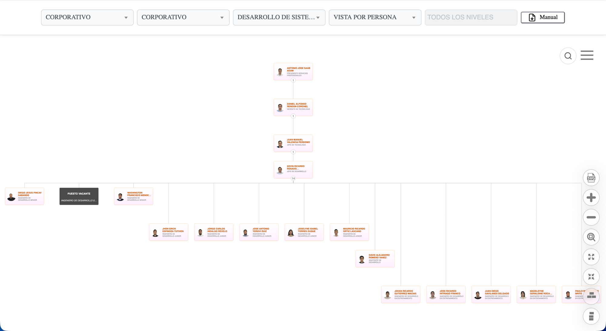

  <h1>🏢 Organigrama Corporativo LIRIS S.A. — QA</h1>

  <blockquote>
        
Visualización interactiva de la estructura organizacional de <strong>LIRIS S.A.</strong>, basada en <strong>Balkan OrgChart JS (Pro)</strong>. Misma base de código que <code>main</code> (producción), pero apuntando al endpoint de <strong>QA</strong> de la API de Delportal — entorno de pruebas antes de promover cambios a producción.

    </blockquote>

   

        
        
        
        
    

  

  <h2>📌 Alcance de esta rama (organigrama-qa)</h2>
    
Rama <strong>espejo de <code>main</code></strong>: mismo HTML, mismos estilos, mismas funciones. La única diferencia de código es el endpoint de la API:

    <table border="1" cellpadding="8" cellspacing="0" style="width: 100%; border-collapse: collapse;">
        <thead style="background: #f4f4f4;">
            <tr><th>Rama</th><th>Endpoint</th></tr>
        </thead>
        <tbody>
            <tr><td><code>main</code></td><td><code>mobile.liris.com.ec</code> (producción)</td></tr>
            <tr><td><code>organigrama-qa</code></td><td><code>mobileqa.liris.com.ec</code> (QA) — marcado en el código con <code>//TODO: APUNTA A QA</code></td></tr>
        </tbody>
    </table>
    
<strong>Propósito:</strong> validar datos y comportamiento contra el ambiente de QA de Delportal antes de fusionar/promover un cambio a <code>main</code>. No agrega ni quita funciones respecto a producción — mismo alcance funcional:

    <ul>
        <li><strong>Navegación del árbol:</strong> maximizar / minimizar, colapsar / expandir ramas, centrar en un nodo.</li>
        <li><strong>Orientación:</strong> vertical y horizontal.</li>
        <li><strong>Exportación:</strong> descarga del organigrama en <strong>SVG</strong>.</li>
        <li><strong>Filtros:</strong> línea de negocio, centro de costos, departamento y nivel jerárquico.</li>
        <li><strong>Vistas:</strong> por <strong>Persona</strong> (empleados) o por <strong>Cargo</strong> (posiciones, incluye puestos vacantes).</li>
        <li><strong>Búsqueda global</strong> y <strong>ficha de detalle</strong> con accesos a los 3 manuales.</li>
    </ul>
    
⚠️ Al probar aquí, los datos (nombres, cargos, vacantes) corresponden al set de <strong>QA</strong>, no al real de producción — pueden no coincidir con lo que ve un usuario final.

  

  <h2>📸 Galería Visual (datos de QA)</h2>

  <table border="0" style="width: 100%;">
        <tr>
            <td style="width: 50%; vertical-align: top;">
                <h3>🔍 Vista por Persona</h3>
                
Raíz del organigrama en QA — incluye el nodo especial <strong>Comité</strong> junto a los reportes directos del Presidente.

                
            </td>
            <td style="width: 50%; vertical-align: top;">
                <h3>👤 Ficha de detalle</h3>
                
Modal de empleado — mismo componente que producción, con datos de QA (nótese el correo <code>@liris.com.ec</code> de prueba).

                
            </td>
        </tr>
    </table>
    
<strong>🧩 Vista por Cargo — filtrada por departamento (Desarrollo de Sistemas)</strong>, con puesto vacante visible:

    

  

  <h2>⚙️ Stack</h2>
    <ul>
        <li><strong>Frontend:</strong> HTML5 + CSS3 + JavaScript vanilla — <strong>sin build ni package manager</strong> (idéntico a <code>main</code>).</li>
        <li><strong>Librería de chart:</strong> Balkan OrgChart JS Pro (<code>BalkanPro/orgchart.js</code>) — no modificar.</li>
        <li><strong>Datos:</strong> API REST de Delportal (WordPress), apuntando al ambiente <strong>QA</strong>: <code>get_organigrama_persona</code> / <code>get_organigrama_cargo</code> en <code>mobileqa.liris.com.ec</code>.</li>
        <li><strong>Despliegue:</strong> mismo wrapper ASP.NET que producción, pero desplegado en el entorno/URL de QA de la intranet.</li>
    </ul>

  <h2>📋 Requisitos</h2>
    <ul>
        <li>Acceso a la <strong>red corporativa interna</strong> (o VPN) — el endpoint QA también vive dentro de la intranet.</li>
        <li>Cualquier servidor estático para estas pruebas locales (Live Server, <code>python3 -m http.server</code>).</li>
    </ul>

  <h2>🚀 Instalación y Desarrollo Local</h2>
  <ol>
        <li>
            <strong>Clonar el repositorio</strong> y hacer checkout de esta rama:
            <pre><code>git clone git@github-empresa:LirisDev/Organigrama.git
git checkout organigrama-qa</code></pre>
        </li>
        <li>
            <strong>Servir el proyecto:</strong> Live Server (VS Code) o <code>python3 -m http.server</code>.
        </li>
        <li>
            <strong>Simular el login</strong> — en <code>index_sistemas_jerarquias.html</code>, dentro de <code>procesarLoginDeUsuario()</code>, descomentar temporalmente:
            <pre><code>receivedUserId = "interno\\dromero"; //Asistente de desarrollo</code></pre>
            
Revertir antes de commitear — es solo para pruebas locales.

        </li>
    </ol>

  <h2>🔄 Antes de promover un cambio a <code>main</code></h2>
    <ul>
        <li>Confirmar que el cambio se probó aquí contra QA y se comporta como se espera.</li>
        <li>El <strong>único diff intencional</strong> con <code>main</code> debe ser la URL del API — si aparecen otros diffs sin explicación al comparar ramas, revisar antes de fusionar (podría ser un cambio que se quedó solo en QA por error).</li>
    </ul>

  <h2>📐 Estándares del equipo</h2>
    
Esta rama sigue los <strong>Estándares de Desarrollo (GitHub y SQL) de LIRIS S.A.</strong> — convención de ramas/commits (<code>tipo(scope): descripción</code>), checklist pre-PR, nunca commit directo a <code>main</code>/<code>develop</code>. Ver documentación interna del equipo antes de abrir un PR.

  <h2>👨‍💻 Autor / Mantenedor</h2>
    

      <strong><a href="https://www.linkedin.com/in/daroyane/" target="_blank" style="text-decoration: none; color: #0077b5; font-size: 1.1em;">David Romero Yánez</a></strong> 
      <em>Ingeniero de Desarrollo</em> 
        Departamento de Sistemas - LIRIS S.A.
    

  

    
<em>Documentación actualizada a Julio 2026.</em>

